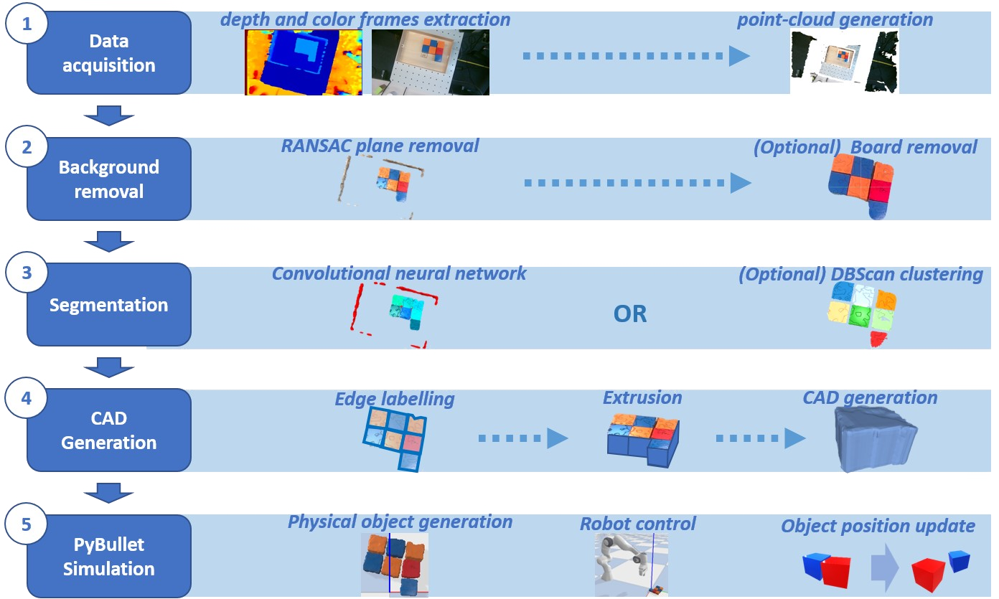

# PandaPush_Depth_Reconstruction :video_camera: :game_die: :mechanical_arm: :robot:

Project on the detection of 3D objects with a realsense Depth camera based on a classifier (Machine Learning) trained with a 3D model of the object.
This project has been realised for the aim of trajectory planning of a Panda robot for non-prehensile manipulation (push tasks) with those 3D objects.



## Functionnalities

:trophy: click [here](https://github.com/LouiseMassager/PandaPush_Depth_Reconstruction/tree/master/res) to see the current results :trophy:
- [x] Synthetic database generation
- [x] Mask-rcnn training
- [x] Data acquisition (recording, colored ply, RGB-D png)
- [x] Segmentation (top-view)
- [ ] Segmentation (random-view)
- [x] Meshing (3D models)
- [x] PyBullet Simulation Initialition
- [ ] CAD Probabilistic Update
- [X] Scene update
- [ ] Robustness improvement (object shapes, point of view, performance...)

## Deployment

To record in live:
```bash
cd UpdatedCode/2023_02_10
python3 main.py
```

To open a recording file "filename.bag", put it in the folder UpdatedCode/2023_02_10/data/recordings and then:
```bash
cd UpdatedCode/2023_02_10
python3 main.py filename.bag
```

## Methodology

:video_camera: [Data Aquisition](https://github.com/LouiseMassager/PandaPush_Depth_Reconstruction/tree/master/Realsense/code) - aquire and save RGBD data (.ply and .png) from the camera

:abacus: [Treatment](https://github.com/LouiseMassager/PandaPush_Depth_Reconstruction/blob/master/Treatment) - isolate objects, aquire their pose and convert them to mesh (.stl)

:desktop_computer: [Simulation](https://github.com/LouiseMassager/PandaPush_Depth_Reconstruction/tree/master/Simulation) - implement them in a Pybullet simulation

:mechanical_arm: Testing (to do) - implementation with the mechanical arm

## Updates
2022/11/20 - [meshconverter.py](https://github.com/LouiseMassager/PandaPush_Depth_Reconstruction/tree/master/Simulation/meshconverter.py) : mesh convertisser from 3D model (.stl) to point cloud (.ply) and vis versa <br />
2022/11/20 - [PybulletSimulation.py](https://github.com/LouiseMassager/PandaPush_Depth_Reconstruction/tree/master/Simulation/PybulletSimulation.py) : implementation of the 3D objects in Pybullet simulation <br />

topic update - use of realsense camera instead of ZED2

2020/11/26 - [Code](https://github.com/LouiseMassager/PandaPush_Depth_Reconstruction/tree/master/Realsense/code) : record and playback videos of realsense camera (.bag) <br />
2020/11/26 - [no_tensorflow](https://github.com/LouiseMassager/PandaPush_Depth_Reconstruction/tree/master/Realsense/no_tensorflow) [tensorflow](https://github.com/LouiseMassager/PandaPush_Depth_Reconstruction/tree/master/Realsense/tensorflow) : example code to use realsense camera with and without tensorflow <br />
2020/11/27 - [Code](https://github.com/LouiseMassager/PandaPush_Depth_Reconstruction/tree/master/Realsense/code) : save under .ply and .png (color and depth) <br />
2020/11/29 - [Code](https://github.com/LouiseMassager/PandaPush_Depth_Reconstruction/tree/master/Realsense/code) : save pointclouds (.ply) with color from recordings (.bag) <br />

2020/12/03 - [treatment.py](https://github.com/LouiseMassager/PandaPush_Depth_Reconstruction/blob/master/Treatment/treatment.py) : Object separation (with pattern, no machine learning) from a top view based on colored pointcloud <br />
2020/12/05 - [edgedetection.py](https://github.com/LouiseMassager/PandaPush_Depth_Reconstruction/blob/master/Treatment/edgedetection.py) : Edge detection and shape reconstruction by extrusion <br />

2020/12/10 - [framechange.py](https://github.com/LouiseMassager/PandaPush_Depth_Reconstruction/blob/master/Treatment/framechange.py) [edgedetection.py](https://github.com/LouiseMassager/PandaPush_Depth_Reconstruction/blob/master/Treatment/edgedetection.py) : Improvement of the edge detection by change of frame of the pointcloud (centering and align face's normal to z axis) <br />
2020/12/11 - [plytomesh.py](https://github.com/LouiseMassager/PandaPush_Depth_Reconstruction/tree/master/Treatment/plytomesh.py) : Automatical conversion from pointcloud to mesh with open3D <br />
2022/12/11 - [PybulletSimulation.py](https://github.com/LouiseMassager/PandaPush_Depth_Reconstruction/tree/master/Simulation/PybulletSimulation.py) : Implementation of the mesh in a Pybullet simulation <br />


2023/02/11 - [Synthetic data](https://github.com/LouiseMassager/PandaPush_Depth_Reconstruction/tree/master/synthetic_database_generation) : pointcloud generation of random cubes (with color and depth noise) + stable positioning + points viewed by camera selection + labelisation <br />
2023/02/16 - [main.py](https://github.com/LouiseMassager/PandaPush_Depth_Reconstruction/blob/master/model_free_detection/main.py) : code cleaning (assembly of code in functions and to launch everything with a single launch)  <br />
2023/02/18 - [main.py](https://github.com/LouiseMassager/PandaPush_Depth_Reconstruction/blob/master/model_free_detection/main.py) : backface and colorisation in Pybullet simulation solving  <br />

2023/02/19 - [main.py](https://github.com/LouiseMassager/PandaPush_Depth_Reconstruction/blob/master/model_free_detection/main.py) : camera positionning and rgb-depth-segmentation images (.png) saving from Pybullet <br /> 

2023/02/23 - [ML_training_PPDR.ipynb](https://github.com/LouiseMassager/PandaPush_Depth_Reconstruction/blob/master/ML_training/ML_training_PPDR.ipynb) : test on Collaboratory of sample codes of existing mask rcnn tf2 <br /> 
2023/02/23 - [Synthetic data](https://github.com/LouiseMassager/PandaPush_Depth_Reconstruction/tree/master/synthetic_database_generation) : extraction of label and depth+rgb information (.png) from Pybullet simulation during the generation of random scene with random cubes <br /> 

2023/03/03 - [ML_training_PPDR.ipynb](https://github.com/LouiseMassager/PandaPush_Depth_Reconstruction/blob/master/ML_training/ML_training_PPDR.ipynb) : adaptation of the mask rcnn sample code to fit generated database : features in .png format and labels in .txt format <br /> 
2023/03/21 - Training in colaboratory for detection of cubes and cylinders shapes based on depth or rgb images <br /> 
2023/03/25 - Installation of tensorflow 2.5 on the Jetson kit pack and launch of the code for training data generation (alternative to Colaboratory) <br /> 
2023/04/7 - [Synthetic data](https://github.com/LouiseMassager/PandaPush_Depth_Reconstruction/tree/master/synthetic_database_generation) : Adaptation of the synthetic database and scene generation to be more similar to experimental data (aligned cubes/cylinders in top view with random orientation)<br /> 

2023/04/9 - [main.py](https://github.com/LouiseMassager/PandaPush_Depth_Reconstruction/blob/master/model_free_detection/main.py) : Generation of image (depth or rgb) from pointcloud (.ply to .png) for application of the mask-rcnn in the main code <br /> 

2023/04/10 - [main.py](https://github.com/LouiseMassager/PandaPush_Depth_Reconstruction/blob/master/model_free_detection/main.py) : Addition of the controlled Panda robot in the PyBullet simulation <br /> 

<br /> 


## Packages

#### General
- Python 3.8.10
- ros noetic
- matplotlib

#### Pointcloud
- Open3D 0.16.0
- pymeshlab

#### Computer Vision (CV)
- opencv (cv2) '4.4.0'
- pyrealsense2 2.53.1
- Pillow (PIL) 22.3.1

#### Machine Learning
- scikit-learn 1.2.1
- tensorflow 2.11.0
- keras 2.11.0


#### Simulation
- pybullet  3.2.5
- (ffmpeg : for recording)

<br /> <br /> <br />
## Resources
#### For this project
- [Colaboratory](https://colab.research.google.com/?utm_source=scs-index) : for working environment (provide online GPU)
- [Mask rcnn for tensorflow 2.x](https://github.com/alsombra/Mask_RCNN-TF2) : for instance segmentation using supervised learning

#### For general knowledge
- [Yolo](https://pjreddie.com/darknet/yolo/) : Real-Time Object Detection (for common knowledge)
- [Mediapipe](https://google.github.io/mediapipe/solutions/objectron) OR [Deep_Object_Pose](https://github.com/NVlabs/Deep_Object_Pose) : for detection of object based on 3D model (with ML training) <br />
[Mediapipecodeexample](https://www.youtube.com/watch?v=f-Ibri14KMY&ab_channel=NicolaiNielsen-ComputerVision%26AI)
